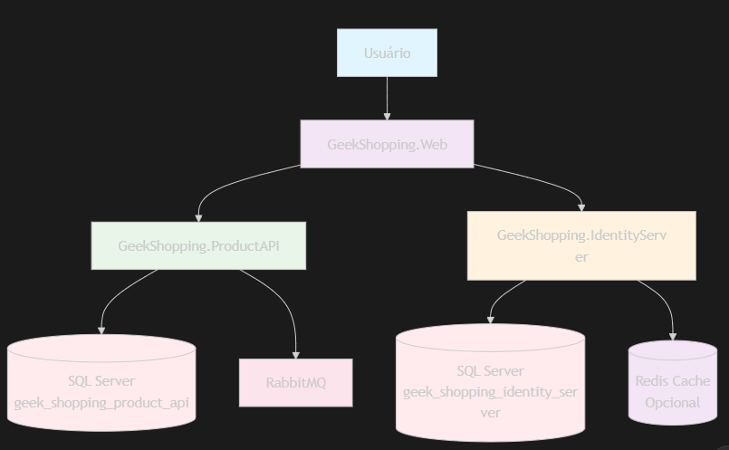
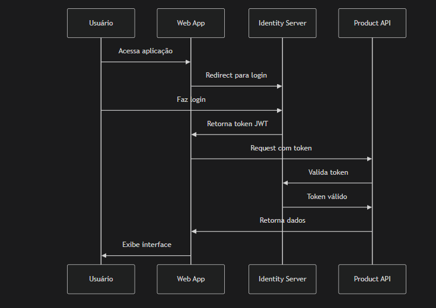

# geekShoppingMicroservicos

GeekShopping 🛒

Projeto desenvolvido para estudo e prática de arquitetura de microsserviços utilizando .NET, com foco em boas práticas, segurança, mensageria e persistência de dados.

⸻

## 📋 Descrição

O GeekShopping é um sistema baseado em microsserviços que implementa operações de CRUD para gerenciamento de produtos.
Além das APIs e do Identity Server, o projeto também conta com um front-end GeekShopping.Web, que permite interação via interface web.

⸻

## 🏗️ Arquitetura do Sistema


⸻

## 🚀 Tecnologias Utilizadas
- **.NET / C#**
- **Visual Studio**
- **SQL Server** - Persistência de dados
- **NuGet** - Gerenciamento de pacotes
- **Identity Server** - Autenticação e emissão de tokens JWT
- **RabbitMQ** - Mensageria (em desenvolvimento)
- **Entity Framework Core** - ORM e Migrations
- **GeekShopping.Web** - Interface web do sistema

⸻

## 🗄️ Configuração do Banco de Dados

### Identity Server Database
```bash
# Navegar para o projeto Identity Server
cd src/GeekShopping.IdentityServer

# Criar migration
dotnet ef migrations add AddDefaultSecurityTableOnDB

# Aplicar migration no banco
dotnet ef database update
```

**Banco de Dados:** `geek_shopping_identity_server`

**Tabelas Criadas:**
- `AspNetRoles` - Roles do sistema
- `AspNetUsers` - Usuários
- `AspNetUserRoles` - Relação usuário-role
- `AspNetUserClaims` - Claims dos usuários
- `AspNetUserLogins` - Logins externos
- `AspNetRoleClaims` - Claims das roles
- `AspNetUserTokens` - Tokens de usuário
- `DeviceCodes` - Códigos de dispositivo
- `Keys` - Chaves de criptografia
- `PersistedGrants` - Grants persistentes
- `ServerSideSessions` - Sessões do servidor

### Product API Database
```bash
# Navegar para o projeto Product API
cd src/GeekShopping.ProductAPI

# Criar migration para produtos
dotnet ef migrations add InitialCreate

# Aplicar migration no banco
dotnet ef database update
```

**Banco de Dados:** `geek_shopping_product_api`

⸻

## 🛠 Funcionalidades
- **CRUD completo via API**: criação, leitura, atualização e exclusão de produtos
- **Autenticação e autorização** com Identity Server e JWT
- **Front-end GeekShopping.Web** para consumo dos serviços
- **Arquitetura baseada em microsserviços**
- **Integração com RabbitMQ** para comunicação assíncrona
- **Migrations automatizadas** com Entity Framework Core

⸻

## 📦 Estrutura do Projeto

```
/GeekShopping
├── src/
│   ├── GeekShopping.ProductAPI/
│   │   ├── Migrations/          # Migrations do Product API
│   │   ├── Models/              # Modelos de dados
│   │   ├── Repository/          # Repositórios
│   │   └── Controllers/         # Controladores API
│   ├── GeekShopping.IdentityServer/
│   │   ├── Migrations/          # Migrations do Identity Server
│   │   ├── Quickstart/          # Configuração rápida
│   │   ├── Config.cs            # Configuração clients/resources
│   │   └── TestUsers.cs         # Usuários de teste
│   └── GeekShopping.Web/
│       ├── Models/              # ViewModels
│       ├── Services/            # Serviços de API
│       └── Views/               # Views Razor
├── docs/
│   └── architecture.md          # Documentação de arquitetura
└── README.md
```

⸻

## 🔧 Como Executar

### 1. Clonar o repositório
```bash
git clone https://github.com/Vanvrs/geekShoppingMicroservicos.git
cd GeekShopping
```

### 2. Configurar Bancos de Dados
```sql
-- Criar bancos no SQL Server
CREATE DATABASE geek_shopping_identity_server;
CREATE DATABASE geek_shopping_product_api;
```

### 3. Aplicar Migrations
```bash
# Identity Server
cd src/GeekShopping.IdentityServer
dotnet ef database update

# Product API
cd ../GeekShopping.ProductAPI
dotnet ef database update
```

### 4. Executar os Projetos
Execute na seguinte ordem:
1. **GeekShopping.IdentityServer** - Serviço de autenticação
2. **GeekShopping.ProductAPI** - API de produtos
3. **GeekShopping.Web** - Interface web

### 5. Configuração Opcional
```bash
# Instalar e configurar RabbitMQ
docker run -d --name rabbitmq -p 5672:5672 -p 15672:15672 rabbitmq:management
```

⸻

## 🔐 Autenticação
- **Identity Server** para autenticação e autorização
- **Token JWT** para acesso seguro às APIs
- **Roles e Claims** para controle de acesso granular
- **Front-end GeekShopping.Web** com autenticação integrada

⸻

## 🗺 Roadmap
- ✅ **Fase 1**: Implementação CRUD com API
- ✅ **Fase 2**: Autenticação via Identity Server + JWT
- ✅ **Fase 3**: Migrations e configuração do banco
- ✅ **Fase 4**: Front-end GeekShopping.Web
- 🔄 **Fase 5**: Integração RabbitMQ para mensageria
- ⏳ **Fase 6**: Contêineres Docker
- ⏳ **Fase 7**: Orquestração Kubernetes

⸻

## 📊 Fluxo de Autenticação



⸻

## 📄 Licença

Este projeto foi desenvolvido para fins educacionais. Você pode adaptá-lo para suas necessidades.

⸻

## 🤝 Contribuições

Contribuições são bem-vindas! Sinta-se à vontade para abrir issues e pull requests.

---
